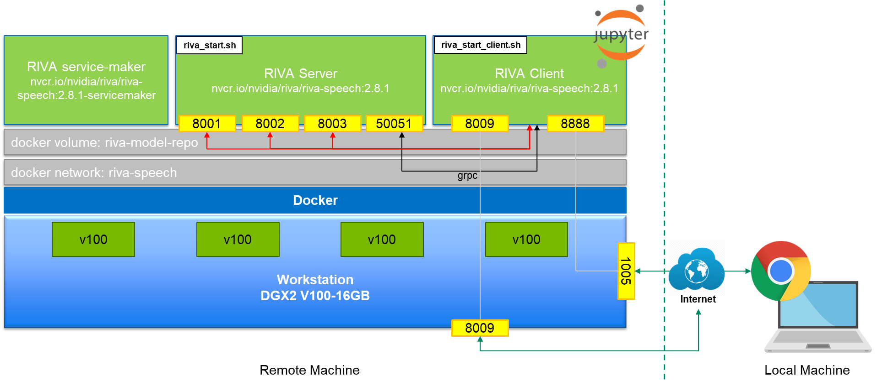

# NVIDIA Riva SDK Demonstration

The contents in this repository is for demonstrating Riva SDK workflow. Please execute the notebook files described below in sequence to avoid some dependencies.

##### 1_riva_api_demo.ipynb
It shows how to use basic riva api with simple examples.

##### 2_dev_with_NeMo.ipynb
It shows how to finetune the existing pre-trained model to your target task using NeMo toolkit based on TTS example(fastptich-HifiGan).

##### 3_build_and_deploy_to_riva.ipynb
It contains how to convert NeMo to Riva format, how to build Riva to get RMIR, and finally, how to deploy it to the Riva Service.

##### 4_appendix_NeMo.ipynb(Optional)
Some additional information about NeMo is included.

## Demo environment
</img>

Docker command used to launch NeMo Container:
```bash
docker run --gpus device=3 -it --rm -p 1005:8888 -p 8009:8009 --network riva-speech -v <my workspace where this repo ls cloned>:/wsoh/workspace nvcr.io/nvidia/nemo.1.5.1
```

## Prerequisite
1. Get access to NGC and install NGC CLI tools.
   - https://docs.nvidia.com/ngc/ngc-overview/index.html#registering-activating-ngc-account


2. Download Riva resources from NGC
```bash
mkdir –p ./resources && cd resources
ngc registry resource download-version "nvidia/riva/riva_quickstart:1.9.0-beta"
```


3. Create docker network
```bash
docker network create riva-speech
```


4. Initialize and start Riva Server
    - Modify `config.sh` with your preffered configuration from downloaded resources. Then, run:
```bash
riva_init.sh
```
    - Add `--network riva-speech` option to docker running command in `riva_start.sh`(around line number 78) from downloaded resources. Then, run:
```bash
riva_start.sh
```


5. Start Riva Client(Optional)
    - You can start Riva client from downloaded resources by executing:
```bash
riva_start_client.sh
```
    - However, we'll not use `riva_start_client.sh` in this demo. We will manually install riva-client in our NeMo container environment.


## Riva Resources
##### riva_api-1.9.0b0-py3-none-any.whl
- Binary wheel for Riva client api

##### nemo2riva-1.9.0b0-py3-none-any.whl
- Binary wheel for format converter from NeMo to Riva

##### riva_init.sh
- Automatically initialize and setup runnable riva environment.
    1. Pull riva container images(server, client, servicemaker)
    2. Download default built models(RMIRs) enabled in `config.sh` from NGC 
         - Download location: `$riva_model_loc/rmir`, which is defined as docker volume
    3. Optimize the downloaded models and deploy them to model repository
         - Deploy location: `$riva_model_loc/models`

##### riva_start.sh
- Start riva server
port # 8000, 8001, 8002 for triton, port 50051(default) for riva-speech api.
- Preload model repos based on desired services

##### riva_start_client.sh
- Start riva client

##### riva_stop.sh
- Shut down riva server container.

##### riva_clean.sh
- Clean up local riva installation.
- You might need to remove docker volume manually, after this shell script is done